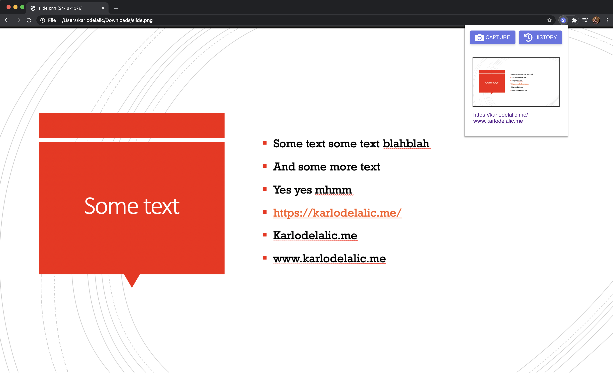
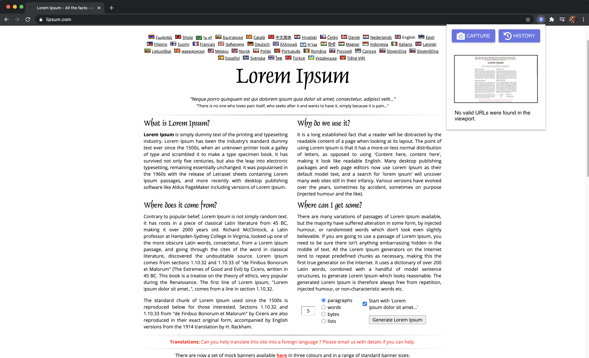
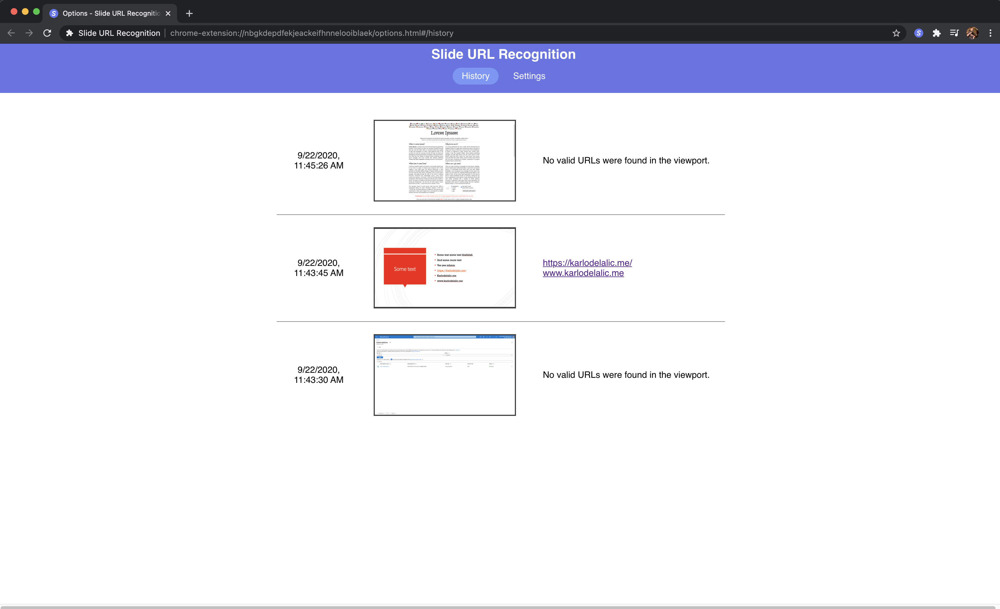
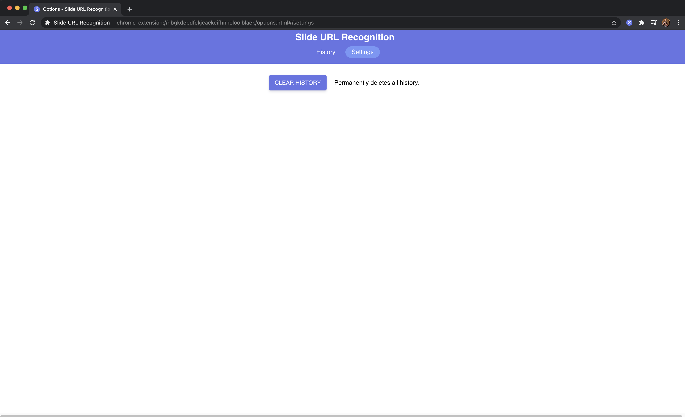

# Slide URL Recognition Chrome Extension

Ever been in a meeting where the presenter had those long pesky URLs in their slides?
Well then this extension is for you!

This extension simply screenshots whatever is on your current tab, runs OCR on the image, and returns a list of valid URLs which are found on your current tab. Everything is done in-memory and screenshots are not kept on disk.

Front end is built with Preact in order to minimize the package size. Backend runs on ExpressJS.

